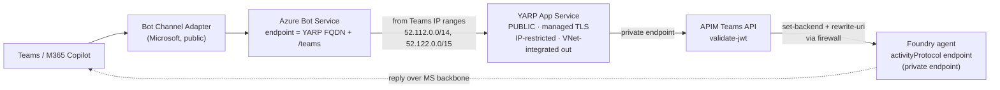

# Azure AI Agent Service: Standard Agent Setup with E2E Network Isolation

> **IMPORTANT**
> 
> Class A subnet support is GA and available in the following regions. **Supported regions: Australia East, Brazil South, Canada East, East US, East US 2, France Central, Germany West Central, Italy North, Japan East, South Africa North, South Central US, South India, Spain Central, Sweden Central, UAE North, UK South, West Europe, West US, West US 3.**
>
> Class B and C subnet support is already GA and available in all regions supported by Azure AI Foundry Agent Service. Deployment templates and setup steps are identical for Class A, B, and C subnets. For more on the supported regions of the Azure AI Foundry Agent service, see [Models supported by Azure AI Foundry Agent Service](https://learn.microsoft.com/en-us/azure/ai-foundry/agents/concepts/model-region-support?tabs=global-standard)

> **IMPORTANT**
> 
> To use your existing APIM resource with Azure AI Foundry in a network isolated environment to build Agents, please deploy this template. The feature is currently in preview with a code first experience and no Foundry UI support. 


---
## Overview
This infrastructure-as-code (IaC) solution deploys a network-secured Azure AI agent environment with private networking and role-based access control (RBAC).

> 🔒 **Network lockdown reference:** for the full, rule-by-rule breakdown of the deny-by-default firewall and agent-subnet NSG (service-tag allow-list, flow logs, and validation steps), see **[NETWORKING.md](./NETWORKING.md)**.


Standard setup provides private network isolation through a **dedicated virtual network with subnet delegation** that the template creates and manages for you.

This implementation gives you full control over the inbound and outbound communication paths for your agent. You can restrict access to only the resources explicitly required by your agent, such as storage accounts, databases, or APIs, while blocking all other traffic by default. This approach ensures that your agent operates within a tightly scoped network boundary, reducing the risk of data leakage or unauthorized access. By default, this setup simplifies security configuration while enforcing strong isolation guarantees, ensuring that each agent deployment remains secure, compliant, and aligned with enterprise networking policies. 

---

## Key Information

**Region and Resource Placement Requirements**
- **All Foundry workspace resources should be in the same region as the VNet**, including CosmosDB, Storage Account, AI Search, Foundry Account, Project, Managed Identity. The only exception is within the Foundry Account, you may choose to deploy your model to a different region, and any cross-region communication will be handled securely within our network infrastructure.
  - **Note:** Your Virtual Network can be in a different resource group than your Foundry workspace resources


---

## Prerequisites

1. **Active Azure subscription with appropriate permissions**
   - **Azure AI Account Owner**: Needed to create a cognitive services account and project 
   - **Owner or Role Based Access Administrator**: Needed to assign RBAC to the required resources (Cosmos DB, Azure AI Search, Storage) 
   - **Azure AI User**: Needed to create and edit agents

1. **Register Resource Providers**

   Make sure you have an active Azure subscription that allows registering resource providers. For example, subnet delegation requires the Microsoft.App provider to be registered in your subscription. If it's not already registered, run the commands below:

   ```bash
   az provider register --namespace 'Microsoft.KeyVault'
   az provider register --namespace 'Microsoft.CognitiveServices'
   az provider register --namespace 'Microsoft.Storage'
   az provider register --namespace 'Microsoft.Search'
   az provider register --namespace 'Microsoft.Network'
   az provider register --namespace 'Microsoft.App'
   az provider register --namespace 'Microsoft.ContainerService'
   ```

1. Network administrator permissions (if operating in a restricted or enterprise environment)

1. Sufficient quota for all resources in your target Azure region
    * If no parameters are passed in, this template creates an Azure AI Foundry resource, Foundry project, Azure Cosmos DB for NoSQL, Azure AI Search, and Azure Storage account
1. Azure CLI installed and configured on your local workstation or deployment pipeline server

---

## Pre-Deployment Steps

### Networking Requirements
1. Review network requirements and plan Virtual Network address space (e.g., 192.168.0.0/16 or an alternative non-overlapping address space)

2. Two subnets are needed as well:  
    - **Agent Subnet** (e.g., 192.168.0.0/24): Hosts Agent client for Agent workloads, delegated to Microsoft.App/environments. The recommended size should be /24 for this delegated subnet. 
    - **Private endpoint Subnet** (e.g. 192.168.1.0/24): Hosts private endpoints 
    - Ensure that the address spaces for these subnets do not overlap with any existing networks in your Azure environment or reserved IP ranges like the following: 169.254.0.0/16, 172.30.0.0/16, 172.31.0.0/16, 192.0.2.0/24, 0.0.0.0/8, 127.0.0.0/8, 100.100.0.0/17, 100.100.192.0/19, 100.100.224.0/19, 10.0.0.0/8.
  
  > **Notes:** 
  - If you do not provide an existing virtual network, the template will create a new virtual network with the default address spaces and subnets described above. If you use an existing virtual network, make sure it already contains two subnets (Agent and Private Endpoint) before deploying the template.
  - You must ensure the Foundry account was successfully created so that underlying caphost has also succeeded. Then proceed to deploying the project caphost bicep. 
  - You must ensure the subnet is not already in use by another account. It must be an exclusive subnet for the Foundry account.
  - You must ensure the subnet is exclusively delegated to __Microsoft.App/environments__ and cannot be used by any other Azure resources.
  

### Account Deletion Prerequisites and Cleanup Guidance

Before deleting an **Account** resource, it is essential to first delete the associated **Account Capability Host**.  
Failure to do so may result in residual dependencies—such as subnets and other provisioned resources (e.g., ACA applications)—remaining linked to the capability host.  
This can lead to errors such as **"Subnet already in use"** when attempting to reuse the same subnet in a different account deployment.

**Cleanup Options**

**1. Full Account Removal**:
You may delete and purge the account.  
The service will automatically handle the deletion of the associated capability host and any linked resources in the background.

**2. Retain Account, Remove Capability Host**:
If you intend to retain the account but remove the capability host, you can use the script `deleteCaphost.sh` located in this folder.

> **Important**: Before deleting the account capability host, ensure that the **project capability host** is deleted.


### Template Customization

This template always provisions a fresh, fully isolated set of resources in the target
resource group:

- VNet and two subnets
- Azure Cosmos DB for NoSQL
- Azure AI Search
- Azure Storage
- Azure Key Vault
- Azure Container Registry
- Private DNS zones and private endpoints for all of the above

Bringing your own (pre-existing) Search, Storage, Cosmos DB, DNS zones, or VNet is **not**
supported — the template creates everything itself to keep the deployment simple and
self-contained.

---

## Optional: Model Gateway (APIM + provider Foundry)

> **APIM is now always deployed.** The APIM Standard v2 instance, its gateway
> spoke (`10.3.0.0/16`), inbound private endpoint and `privatelink.azure-api.net`
> DNS zone are **shared infrastructure** — provisioned unconditionally because both
> the model gateway *and* the Teams / M365 publish path route through them.
> `enableModelGateway` now only gates the **provider Foundry** account, the APIM
> inference API/connection, and the second seeded agent.

Set `enableModelGateway=true` (default **false**) to deploy an optional,
enterprise-grade model gateway in the shared gateway spoke (`10.3.0.0/16`):

- **APIM Standard v2** with an inbound **private endpoint** and outbound **VNet
  integration** — no public gateway access.
- A minimal **provider AI Foundry** account (public access disabled, private
  endpoint only) exposing a `gpt-5.4-mini` deployment behind APIM.
- An `ApiManagement` connection advertising APIM to the primary Foundry project,
  and a **second seeded agent** using the model `model-gateway/gpt-5.4-mini`.

Models are discovered **dynamically**: instead of a static list, APIM exposes
`GET /deployments` and `GET /deployments/{name}`, which proxy the provider account's
**Azure Resource Manager** deployments API and return the AzureOpenAI-format list the
Foundry connection parses at runtime.

Auth is defense-in-depth: callers must present **both** a valid Entra JWT
(`validate-azure-ad-token`) **and** an APIM subscription **`api-key`** (sent by the
connection). APIM authenticates to the provider Foundry with its own managed
identity — granted **Cognitive Services User** (data-plane inference) and **Reader**
(ARM deployments read for discovery) on the provider account. APIM logs to both Log
Analytics and the shared **Application Insights** component. See [NETWORKING.md](./NETWORKING.md#optional-model-gateway-spoke-apim--provider-foundry).

Key parameters (see [`infra/main.parameters.json`](./infra/main.parameters.json)):

| Parameter | Default | Purpose |
|-----------|---------|---------|
| `enableModelGateway` | `false` | Master switch for the whole gateway spoke. |
| `gatewayModelName` | `gpt-5.4-mini` | Model deployed on the provider and exposed via APIM. |
| `gatewayCallerAppId` | `''` | Optional caller app/client ID pinned in the JWT policy. |
| `gatewayApiKey` | `''` (secure) | Optional explicit `api-key`; empty = deterministic derived key. |

> **Note:** APIM Standard v2 provisioning is slow (~15–45 min), so enabling this
> materially increases deployment time.

---

## Optional: Publish an agent to Teams / M365 Copilot

The Teams / M365 publish path is **on by default** (`enableTeamsPublish=true`; set it
`false` to opt out). It publishes the primary seeded agent (`hello-world-agent`) to
**Microsoft Teams and Microsoft 365 Copilot**, even
though the Foundry endpoint has public network access disabled. This follows the
Learn article
[Publish agents to Microsoft 365 and Teams by using the REST API](https://learn.microsoft.com/en-us/azure/foundry/agents/how-to/publish-copilot-virtual-network),
with the corporate-firewall specifics from
[Foundry agents and custom engine agents through the corporate firewall](https://techcommunity.microsoft.com/blog/azure-ai-foundry-blog/foundry-agents-and-custom-engine-agents-through-the-corporate-firewall/4502218).

### Inbound path

Because the Foundry agent lives behind a private endpoint, Microsoft's Bot Channel
Adapter (which runs on the public internet) can't reach it directly. Traffic flows:



Two firewall dependencies make this work:
- **APIM → `login.botframework.com` (HTTPS:443)** so `validate-jwt` can fetch the Bot
  Framework IdP's OpenID Connect metadata + signing keys. APIM is force-tunnelled
  through the firewall, so **without this rule every inbound activity fails with a
  `401`** (the signing-key fetch is denied). See
  [`gateway-firewall-rules.bicep`](./infra/modules/model-gateway/gateway-firewall-rules.bicep).
- **APIM → primary Foundry private endpoint** (a cross-spoke network rule) to reach the
  activityProtocol endpoint.

The agent's reply travels back to the caller over the Microsoft backbone (not out
through your firewall), so no additional agent-subnet outbound rules are required.

**Single-tenant lockdown:** the token has no `tid` claim, but its signed `serviceurl`
embeds the caller's tenant GUID (`smba.trafficmanager.net/<region>/<tenantId>/`). The
APIM policy asserts that GUID equals the deployment tenant (`expectedTenantId`, wired
from `tenant().tenantId`) and returns `403` otherwise — so only your own tenant's
activities are accepted, on top of the `aud`/`iss`/signature checks.

### The firewall / DNS tradeoff

The Learn article's happy path keeps the bot's messaging endpoint set to the agent's
private `*.services.ai.azure.com` activityProtocol URL and relies on **custom DNS +
firewall DNAT + a TLS certificate** for that hostname so the adapter resolves it to
your perimeter. **We deliberately skip that**: the bot's messaging endpoint is the
YARP App Service's own public FQDN with an App Service **managed certificate**, so no
custom DNS or cert is needed. YARP forwards to APIM, which rewrites to the private
activityProtocol endpoint.

> This is **not the ideal production perimeter** — it exposes the YARP App Service
> publicly (hardened only by an inbound IP allow-list of the **Microsoft Teams
> published IP ranges** [`52.112.0.0/14`, `52.122.0.0/15` + IPv6, default-Deny] + the
> APIM `validate-jwt` token check). The article-recommended alternative is an
> **Azure Application Gateway** (public IP + managed cert + WAF) fronting the private
> path. This template demonstrates the simpler pattern; swap in App Gateway for a
> stronger perimeter.
>
> ⚠️ **Note:** the `AzureBotService` service tag is **not** the right allow-list — it
> covers DirectLine + the Bot Service token cache, not the Teams channel adapter's
> source IPs. Use the Teams *Required* ranges from the
> [M365 endpoints service](https://learn.microsoft.com/en-us/microsoft-365/enterprise/urls-and-ip-address-ranges)
> (service area `Skype`), as this template does.

### Hook-driven publish

Steps 2–4 need values that only exist **after** the agent is seeded (the agent
identity `principal_id` = the bot Microsoft App ID), so publishing is driven by the
azd **postdeploy** hook ([`hooks/postdeploy.ps1`](./hooks/postdeploy.ps1)) rather than
Bicep. **Strict boundary:** the private VM only ever calls Foundry REST APIs; every
ARM / Bicep / APIM control-plane action runs host-side, outside the VNet.

1. **Get identity** *(on the VM — Foundry REST)* — runs
   [`scripts/publish-teams.ps1`](./scripts/publish-teams.ps1) on the private VM (via
   `az vm run-command`) to read `instance_identity.principal_id`.
2. **Create the Azure Bot Service** *(host-side)* — `az deployment group create` of
   [`hooks/bot-service.bicep`](./hooks/bot-service.bicep) (azurebot, PNA disabled,
   single-tenant, MsTeams channel; endpoint = YARP public FQDN + `/teams`).
3. **Pin the APIM `validate-jwt` audience** *(host-side)* to the bot App ID
   (best-effort; issuer validation + IP restriction stay active if it fails).
4. **Publish** *(on the VM — Foundry REST)* — the VM script enables the `activity`
   protocol + `BotServiceRbac` scheme (keeping `responses` + `Entra`), then calls the
   Microsoft 365 publish API.

> **Publish needs a delegated *user* token (OBO), not the VM managed identity.**
> Foundry's `microsoft365/publish` API performs an on-behalf-of exchange with the
> caller's token to submit to the M365 catalog, so an app-only / MSI token fails
> server-side with a bare `502`. The hook acquires a **host-side user token**
> (`az account get-access-token --resource https://ai.azure.com`) and passes it to the
> publish call only; the earlier PATCH steps still run under the VM MSI. This preserves
> the boundary — the VM never handles ARM/control-plane, only Foundry REST.

The hook is idempotent — re-running skips an already-published `appVersion`. Bump
`TEAMS_APP_VERSION` (via `azd env set`) to roll out user-facing metadata changes.

Key parameters:

| Parameter | Default | Purpose |
|-----------|---------|---------|
| `enableTeamsPublish` | `true` | Master switch: Teams APIM API + public YARP flip + the postdeploy publish hook. Set `false` to opt out. |
| `teamsAgentName` | `hello-world-agent` | Seeded agent to publish (its activityProtocol endpoint is the APIM backend). |
| `teamsBotAppId` | `''` | Optional pre-known bot App ID for the APIM `validate-jwt` audience; empty = issuer-only at provision, pinned live by the hook. |

Optional publish metadata is read from env by the hook (`azd env set`):
`TEAMS_BOT_DISPLAY_NAME`, `TEAMS_PUBLISH_SCOPE` (`Shared`/`Tenant`), `TEAMS_APP_VERSION`,
`TEAMS_SHORT_DESCRIPTION`, `TEAMS_FULL_DESCRIPTION`, `TEAMS_DEVELOPER_NAME`,
`TEAMS_DEVELOPER_WEBSITE_URL`, `TEAMS_PRIVACY_URL`, `TEAMS_TERMS_OF_USE_URL`.

> **Caller RBAC:** VM run-command invoke (e.g. *Virtual Machine Contributor*) +
> *Azure Bot Service Contributor* (create the bot) + *Foundry User* on the project.
> The `Microsoft.BotService` resource provider is registered by the hook.

See [NETWORKING.md](./NETWORKING.md#optional-teams--m365-publish-inbound-path) for
the inbound/return firewall and routing details.

---

## Deploy with `azd`

[Azure Developer CLI](https://aka.ms/azd) (`azd`) is the only supported deployment path.
All infrastructure lives under [`infra/`](./infra) and is wired through
[`azure.yaml`](./azure.yaml).

```bash
azd up          # provision infrastructure (+ predeploy hook once a service is defined)
# or, to provision only:
azd provision
```

`azd` reads [`infra/main.parameters.json`](./infra/main.parameters.json), which maps each
Bicep parameter to an `azd` environment variable with an inline default (`${VAR=default}`).
A fresh `azd up` uses those defaults with no extra setup. Override any value per environment
before provisioning:

```bash
azd env set ENABLE_MODEL_GATEWAY false
azd env set AZURE_LOCATION eastus2
```

`vmAdminPassword` has no Bicep default and is deliberately **omitted** from
`main.parameters.json`, so `azd` prompts for it interactively at provision time — it is
never stored in the repo.

> **Note:** To access your Foundry resource securely, use either a VM, VPN, or ExpressRoute.

> **Note:** `azd provision` creates all infrastructure but **does not seed agents**. Seed
> them separately (see below).

> **Note — CMK / Key Vault propagation:** provisioning may occasionally fail the first time
> with `KeyVaultAuthenticationFailure` / `AccessPolicyNotConfiguredForKeyVault`
> ("managed identity is forbidden ... to wrap & unwrap"). This is an Azure RBAC
> **role-assignment propagation delay** — the Key Vault Crypto role granted to the AI Services
> and Storage identities can take 1–5 minutes to become effective in the Key Vault data plane,
> and the customer-managed-key (CMK) enablement step sometimes runs before it propagates. The
> deployment is **idempotent**: simply re-run `azd provision` (or `azd up`). The already-created
> resources are skipped and the CMK step succeeds once the roles have propagated.

---

## Seeding agents

The Foundry endpoint is private, so agents are created by running
[`scripts/seed-agents.ps1`](./scripts/seed-agents.ps1) **on the locked-down VM** (the only
host inside the VNet that can reach the private endpoint). This is wired as an
[Azure Developer CLI](https://aka.ms/azd) **`predeploy` hook**
([`hooks/predeploy.ps1`](./hooks/predeploy.ps1)), which uses `az vm run-command` to execute
the script on the VM.

Once infrastructure is provisioned (so the Bicep outputs are in the azd environment):

```bash
# Iterate on agents without re-provisioning:
azd hooks run predeploy

# Or, as part of a full deploy (runs the predeploy hook first):
azd deploy
```

To change which agents are created, edit the `$agentsToCreate` array in
`scripts/seed-agents.ps1`. The script is **idempotent** — agents that already exist (matched
by name) are skipped, so re-running is safe.

**Requirements:**
- `az` CLI and PowerShell (`pwsh`) on the machine running the hook.
- The caller needs permission to invoke VM run-commands
  (`Microsoft.Compute/virtualMachines/runCommands/*`, e.g. **Virtual Machine Contributor**
  on the VM/resource group). The VM's own managed identity already holds **Foundry User** on
  the project (granted by the template) so the on-VM script can call the Agents API.
- `azd deploy` only triggers the hook once a service is defined in `azure.yaml`;
  `azd hooks run predeploy` works regardless and is the quickest way to (re)seed.

To (re)seed agents manually — for example outside the hook or from another host inside the
VNet — run the seeding script yourself, e.g. `az vm run-command invoke --command-id
RunPowerShellScript --name <vm-name> -g <rg> --scripts @scripts/seed-agents.ps1 --parameters
"FoundryProjectEndpoint=<endpoint>" "ModelDeploymentName=<model>"`.

---

## Network Secured Agent Project Architecture Deep Dive

### Core Components

**Azure AI Foundry** resource
- Central orchestration point
- Manages service connections
- Set networking and policy configurations

**Foundry** project
- Defines the workspace configuration 
- Service integration 
- Agents are created within a specific project, and each project acts as an isolated workspace. This means:
  - All agents in the same project share access to the same file storage, thread storage (conversation history), and search indexes.
  - Data is isolated between projects. Agents in one project cannot access resources from another. Projects are currently the unit of  sharing and isolation in Foundry. See the what is AI foundry article for more information on Foundry projects. 

**Bring Your Own (BYO) Azure Resources**: ensures all sensitive data remains under customer control. All agents created using our service are stateful, meaning they retain information across interactions. With this setup, agent states are automatically stored in customer-managed, single-tenant resources. The required Bring Your Own Resources include: 
- BYO File Storage: All files uploaded by developers (during agent configuration) or end-users (during interactions) are stored directly in the customer’s Azure Storage account.
- BYO Search: All vector stores created by the agent leverage the customer’s Azure AI Search resource.
- BYO Thread Storage: All customer messages and conversation history will be stored in the customer’s own Azure Cosmos DB account.

By bundling these BYO features (file storage, search, and thread storage), the standard setup guarantees that your deployment is secure by default. All data processed by Azure AI Foundry Agent Service is automatically stored at rest in your own Azure resources, helping you meet internal policies, compliance requirements, and enterprise security standards.

### Azure Resources Created

Azure AI Foundry (Cognitive Services)
- Type: Microsoft.CognitiveServices/accounts
- API version: 2025-04-01-preview
- Kind: AIServices
- SKU: S0
- Identity: System-assigned
- Features:
  - Custom subdomain name
  - Disabled public network access
  - Network ACLs with Azure Services bypass 

AI Model Deployment 
- Type: Microsoft.CognitiveServices/accounts/deployments 
- API version: 2025-04-01-preview
- SKU: Based on modelSkuName parameter, capacity set by modelCapacity 
- Model properties:
  - Name: From modelName parameter
  - Format: From modelFormat parameter
  - Version: From modelVersion parameter 

Azure AI Search 
- Type: Microsoft.Search/searchServices
- API version: 2024-06-01-preview
- SKU: standard 
- Partition Count: 1 
- Replica Count: 1 
- Hosting Mode: default 
- Semantic Search: disabled
- Features:
  -  Disabled public network access
  -  AAD auth with HTTP 401 challenge
  -  System-assigned managed identity

Storage Account 
- Type: Microsoft.Storage/storageAccounts 
- API version: 2023-05-0
- Kind: StorageV2 
- SKU: ZRS or GRS (region dependent; use Standard_GRS if ZRS not available) 
- Features:
  - Blob service, Queue service (if Azure Function Tool supported)
  - Minimum TLS Version: 1.2
  - Block public blob access
  - Disabled public network access
  - Force Azure AD authentication (SharedKey access disabled) 

Cosmos DB Account 
- Type: Microsoft.DocumentDB/databaseAccounts 
- API version: 2024-11-15 
- Kind: GlobalDocumentDB (SQL API) 
- Consistency Level: Session 
- Database Account Offer Type: Standard 
- Features:
  - Disabled public network access
  - Disabled local auth
  - Single region deployment 

### Network Security Design
This implementation uses a dedicated virtual network with subnet delegation. The template creates the virtual network and one delegated subnet for the agent.

Network Security
- Public network access disabled
- Private endpoints for all services
- Network ACLs with deny by default

**Network Infrastructure**
- A Virtual Network (192.168.0.0/16) is created (if existing isn't passed in)
- Agent Subnet (192.168.0.0/24): Hosts Agent client
- Private endpoint Subnet (192.168.1.0/24): Hosts private endpoints

**Private Endpoints** 
Private endpoints ensure secure, internal-only connectivity. Private endpoints are created for the following:
- Azure AI Foundry
- Azure AI Search
- Azure Storage
- Azure Cosmos DB
- Azure API Management (if provided)

**Private DNS Zones**
| Private Link Resource Type | Sub Resource | Private DNS Zone Name | Public DNS Zone Forwarders |
|----------------------------|--------------|------------------------|-----------------------------|
| **Azure AI Foundry**       | account      | `privatelink.cognitiveservices.azure.com`<br>`privatelink.openai.azure.com`<br>`privatelink.services.ai.azure.com` | `cognitiveservices.azure.com`<br>`openai.azure.com`<br>`services.ai.azure.com` |
| **Azure AI Search**        | searchService| `privatelink.search.windows.net` | `search.windows.net` |
| **Azure Cosmos DB**        | Sql          | `privatelink.documents.azure.com` | `documents.azure.com` |
| **Azure Storage**          | blob         | `privatelink.blob.core.windows.net` | `blob.core.windows.net` |
| **Azure API Management** (Optional) | Gateway     | `privatelink.azure-api.net` | `azure-api.net` |

### Authentication & Authorization

- **Managed Identity**
  - Zero-trust security model
  - No credential storage
  - Platform-managed rotation

  This template uses System Managed Identity, but User Assigned Managed Identity is also supported.

- **Role Assignments**
  - **Azure AI Search**
    - Search Index Data Contributor (`8ebe5a00-799e-43f5-93ac-243d3dce84a7`)
    - Search Service Contributor (`7ca78c08-252a-4471-8644-bb5ff32d4ba0`)
  - **Azure Storage Account**
    - Storage Blob Data Owner (`b7e6dc6d-f1e8-4753-8033-0f276bb0955b`)
    - Storage Queue Data Contributor (`974c5e8b-45b9-4653-ba55-5f855dd0fb88`) (if Azure Function tool enabled)
    - Two containers will automatically be provisioned during the project create capability host process:
      - Azure Blob Storage Container: `<workspaceId>-azureml-blobstore`
        - Storage Blob Data Contributor
      - Azure Blob Storage Container: `<workspaceId>-agents-blobstore`
        - Storage Blob Data Owner
  - **Cosmos DB for NoSQL**
    - Cosmos DB Operator (`230815da-be43-4aae-9cb4-875f7bd000aa`)
    - Cosmos DB Built-in Data Contributor
    - Three containers will automatically be provisioned during the create capability host process:
      - Cosmos DB for NoSQL container: `<${projectWorkspaceId}>-thread-message-store`
      - Cosmos DB for NoSQL container: `<${projectWorkspaceId}>-system-thread-message-store`
      - Cosmos DB for NoSQL container: `<${projectWorkspaceId}>-agent-entity-store`


---

## Module Structure

```text
infra/
├── main.bicep                  # Orchestrator: wires all modules + emits azd outputs
├── main.parameters.json        # azd parameter file (${VAR=default} env bindings)
└── modules/
    ├── network/                # VNets (hub + spokes), subnets, peering, DNS resolver,
    │                           #   firewall, private endpoints, flow logs
    ├── foundry/                # AI account/project identity, capability host,
    │                           #   workspace-id formatting
    ├── resources/              # ACR, Key Vault, VM, App Service, dependent resources
    │                           #   (Cosmos/Storage/Search)
    ├── encryption/             # CMK encryption for ACR, AI account, Storage
    ├── rbac/                   # All role assignments (incl. VM → Foundry User)
    └── model-gateway/          # Optional APIM Standard v2 + provider Foundry spoke
```

> **Note:** The template always creates the VNet and delegates the Agents subnet to `Microsoft.App/environments` for you.

## Maintenance

### Regular Tasks

1. Review role assignments
2. Monitor network security
3. Check service health
4. Update configurations as needed

### Troubleshooting

1. Verify private endpoint connectivity
2. Check DNS resolution
3. Validate role assignments
4. Review network security groups

**`KeyVaultAuthenticationFailure` / `AccessPolicyNotConfiguredForKeyVault` during provisioning**
— an RBAC role-assignment propagation delay, not a misconfiguration. The CMK enablement step
occasionally runs before the Key Vault Crypto role (granted to the AI Services / Storage
identities) becomes effective in the Key Vault data plane (1–5 min). Re-run `azd provision` —
the deployment is idempotent and succeeds on the retry.

---

## References

- [Azure AI Foundry Networking Documentation](https://learn.microsoft.com/en-us/azure/ai-foundry/how-to/configure-private-link?tabs=azure-portal&pivots=fdp-project)
- [Azure AI Foundry RBAC Documentation](https://learn.microsoft.com/en-us/azure/ai-foundry/concepts/rbac-azure-ai-foundry?pivots=fdp-project)
- [Private Endpoint Documentation](https://learn.microsoft.com/en-us/azure/private-link/)
- [RBAC Documentation](https://learn.microsoft.com/en-us/azure/role-based-access-control/)
- [Network Security Best Practices](https://learn.microsoft.com/en-us/azure/security/fundamentals/network-best-practices)
