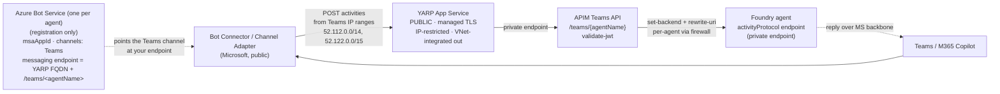

# Publish an agent to Teams / M365 Copilot

> Part of the [network-secured Foundry agent](../README.md) accelerator. Networking deep-dive: [NETWORKING.md](../NETWORKING.md#teams--m365-publish-inbound-path).

The Teams / M365 publish path is **always deployed**. It publishes **every seeded agent** (`hello-world-agent`,
`gateway-model-agent`, `teams-agent`) to Teams / M365, each with its own Azure Bot
Service. A **single, path-routed APIM Teams API** listens on `/teams/{agentName}` and
rewrites each request to the matching agent's activityProtocol endpoint, so one API
backs any number of agents. Edit `teamsPublishAgentNames` to change which agents are
published. This publishes to
**Microsoft Teams and Microsoft 365 Copilot**, even
though the Foundry endpoint has public network access disabled. This follows the
Learn article
[Publish agents to Microsoft 365 and Teams by using the REST API](https://learn.microsoft.com/en-us/azure/foundry/agents/how-to/publish-copilot-virtual-network),
with the corporate-firewall specifics from
[Foundry agents and custom engine agents through the corporate firewall](https://techcommunity.microsoft.com/blog/azure-ai-foundry-blog/foundry-agents-and-custom-engine-agents-through-the-corporate-firewall/4502218).

### The Azure Bot Service is a registration, not an appliance

The **Azure Bot Service is only a registration**. It doesn't listen for or process any
traffic. It holds the bot identity (`msaAppId`) and a **messaging endpoint**, and it
connects **bot channels** — of which **Microsoft Teams** is the one we use — to that
endpoint. In this template each agent's messaging endpoint points at the **YARP App Service**
(`https://<yarp-fqdn>/teams/<agentName>`). Microsoft's public **Bot Connector** reads the
registration to learn which endpoint a channel should deliver to, then POSTs activities
straight there. So the request path is **Teams → Bot Connector → YARP**; the Bot Service
resource sits off to the side as configuration, never in the data path.

### Inbound path

Because the Foundry agent lives behind a private endpoint, the public Bot Connector
can't reach it directly, so the messaging endpoint points at the public YARP proxy,
which forwards inward:

Two firewall dependencies make this work:
- **APIM → `login.botframework.com` (HTTPS:443)** so `validate-jwt` can fetch the Bot
  Framework IdP's OpenID Connect metadata + signing keys. APIM is force-tunnelled
  through the firewall, so **without this rule every inbound activity fails with a
  `401`** (the signing-key fetch is denied). See
  [`gateway-firewall-rules.bicep`](../infra/stages/30-governance/model-gateway/gateway-firewall-rules.bicep).
- **APIM → primary Foundry private endpoint** (a cross-spoke network rule) to reach the
  activityProtocol endpoint.

The agent's reply travels back to the caller over the Microsoft backbone (not out
through your firewall), so no additional agent-subnet outbound rules are required.

**Single-tenant lockdown:** the token has no `tid` claim, but its signed `serviceurl`
embeds the caller's tenant GUID (`smba.trafficmanager.net/<region>/<tenantId>/`). The
APIM policy asserts that GUID equals the deployment tenant (`expectedTenantId`, wired
from `tenant().tenantId`) and returns `403` otherwise — so only your own tenant's
activities are accepted, on top of the `aud`/`iss`/signature checks.

### The firewall / DNS tradeoff

The Learn article's happy path keeps the bot's messaging endpoint set to the agent's
private `*.services.ai.azure.com` activityProtocol URL and relies on **custom DNS +
firewall DNAT + a TLS certificate** for that hostname so the adapter resolves it to
your perimeter. **We deliberately skip that**: the bot's messaging endpoint is the
YARP App Service's own public FQDN with an App Service **managed certificate**, so no
custom DNS or cert is needed. YARP forwards to APIM, which rewrites to the private
activityProtocol endpoint.

> This is **not the ideal production perimeter** — it exposes the YARP App Service
> publicly (hardened only by an inbound IP allow-list of the **Microsoft Teams
> published IP ranges** [`52.112.0.0/14`, `52.122.0.0/15` + IPv6, default-Deny] + the
> APIM `validate-jwt` token check). The article-recommended alternative is an
> **Azure Application Gateway** (public IP + managed cert + WAF) fronting the private
> path. This template demonstrates the simpler pattern; swap in App Gateway for a
> stronger perimeter.
>
> ⚠️ **Note:** the `AzureBotService` service tag is **not** the right allow-list — it
> covers DirectLine + the Bot Service token cache, not the Teams channel adapter's
> source IPs. Use the Teams *Required* ranges from the
> [M365 endpoints service](https://learn.microsoft.com/en-us/microsoft-365/enterprise/urls-and-ip-address-ranges)
> (service area `Skype`), as this template does.

### Hook-driven publish

Steps 2–4 need values that only exist **after** the agents are seeded (each agent
identity `principal_id` = that bot's Microsoft App ID), so publishing is driven by the
azd **postdeploy** hook ([`hooks/postdeploy.ps1`](../hooks/postdeploy.ps1)) rather than
Bicep. The hook **loops over `TEAMS_PUBLISH_AGENT_NAMES`**, publishing each agent with
its own bot. **Strict boundary:** the private VM only ever calls Foundry REST APIs; every
ARM / Bicep / APIM control-plane action runs host-side, outside the VNet.

Per agent:

1. **Get identity** *(on the VM — Foundry REST)* — runs
   [`scripts/publish-teams.ps1`](../scripts/publish-teams.ps1) on the private VM (via
   `az vm run-command`) to read `instance_identity.principal_id`.
2. **Create the Azure Bot Service registration** *(host-side)* — `az deployment group create` of
   [`hooks/bot-service.bicep`](../hooks/bot-service.bicep) (azurebot, PNA disabled,
   single-tenant, **Teams channel**; name `<TEAMS_BOT_NAME>-<agentName>`, messaging
   endpoint = YARP public FQDN + `/teams/<agentName>`). This is registration/config only —
   it points the Teams channel at YARP; it does not receive traffic itself.
4. **Publish** *(on the VM — Foundry REST)* — the VM script enables the `activity`
   protocol + `BotServiceRbac` scheme (keeping `responses` + `Entra`), then calls the
   Microsoft 365 publish API.

Then **once**, after every bot exists:

3. **Set the APIM `validate-jwt` audience allowlist** *(host-side)* to the SET of all
   published bot App IDs (best-effort; issuer validation + IP restriction stay active if
   it fails).

> **Publish needs a delegated *user* token (OBO), not the VM managed identity.**
> Foundry's `microsoft365/publish` API performs an on-behalf-of exchange with the
> caller's token to submit to the M365 catalog, so an app-only / MSI token fails
> server-side with a bare `502`. The hook acquires a **host-side user token**
> (`az account get-access-token --resource https://ai.azure.com`) and passes it to the
> publish call only; the earlier PATCH steps still run under the VM MSI. This preserves
> the boundary — the VM never handles ARM/control-plane, only Foundry REST.

The hook is idempotent — re-running skips an already-published `appVersion`. Bump
`TEAMS_APP_VERSION` (via `azd env set`) to roll out user-facing metadata changes.

Key parameters:

| Parameter | Default | Purpose |
|-----------|---------|---------|
| `teamsPublishAgentNames` | `['hello-world-agent','gateway-model-agent','teams-agent']` | Seeded agents to publish. Each gets its own Azure Bot Service (endpoint `/teams/<agentName>`); the single path-routed APIM Teams API rewrites to each agent's activityProtocol endpoint. |
| `teamsBotAppIds` | `[]` | Optional pre-known bot App IDs for the APIM `validate-jwt` audience allowlist; empty = issuer-only at provision, allowlist set live by the hook once all agents are seeded. |

Optional publish metadata is read from env by the hook (`azd env set`):
`TEAMS_PUBLISH_SCOPE` (`Shared`/`Tenant`), `TEAMS_APP_VERSION`,
`TEAMS_SHORT_DESCRIPTION`, `TEAMS_FULL_DESCRIPTION`, `TEAMS_DEVELOPER_NAME`,
`TEAMS_DEVELOPER_WEBSITE_URL`, `TEAMS_PRIVACY_URL`, `TEAMS_TERMS_OF_USE_URL`.

> Each published agent's display name (bot + M365 catalog title) is
> `<uniqueSuffix>-<agentName>` (e.g. `jwm3-teams-agent`), prefixed with the environment's
> unique resource suffix (`TEAMS_NAME_PREFIX`) so agents from different deployments stay
> distinct in a shared tenant catalog instead of colliding on a bare name like `teams-agent`.

> **Caller RBAC:** VM run-command invoke (e.g. *Virtual Machine Contributor*) +
> *Azure Bot Service Contributor* (create the bot) + *Foundry User* on the project.
> The `Microsoft.BotService` resource provider is registered by the hook.

See [NETWORKING.md](../NETWORKING.md#teams--m365-publish-inbound-path) for
the inbound/return firewall and routing details.
